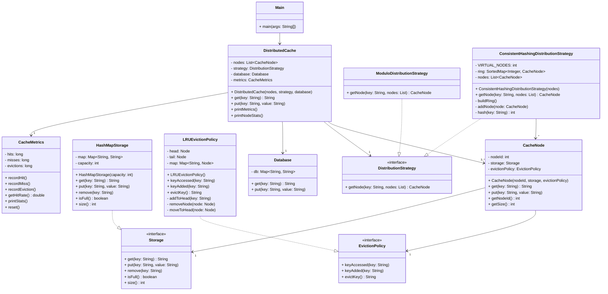

# Distributed Cache System - Class Diagram

## Architecture Overview

**DistributedCache**: Main entry point managing multiple cache nodes, distribution strategy, and metrics tracking.

**CacheNode**: Individual cache instance with its own storage and eviction policy. Supports synchronized get/put operations.

**Storage Interface**: Abstraction for cache storage (currently HashMap-based with ConcurrentHashMap for thread safety).

**EvictionPolicy Interface**: Handles cache replacement when full. LRU implementation uses a doubly-linked list for O(1) operations.

**DistributionStrategy Interface**:
- **ModuloDistribution**: Basic hash distribution (problematic when nodes scale)
- **ConsistentHashingDistribution**: Advanced distribution with virtual nodes (minimal rehashing on node changes)

**Database**: Persistent storage for cache misses (write-through consistency).

**CacheMetrics**: Tracks hit rate, miss rate, and eviction statistics for monitoring.

## Key Improvements Made

✅ **Thread Safety**: ConcurrentHashMap + synchronized methods
✅ **O(1) LRU**: Doubly-linked list instead of Deque
✅ **Scalable Hashing**: Consistent hashing for minimal key movement
✅ **Monitoring**: Hit rate, miss rate, and per-node statistics
