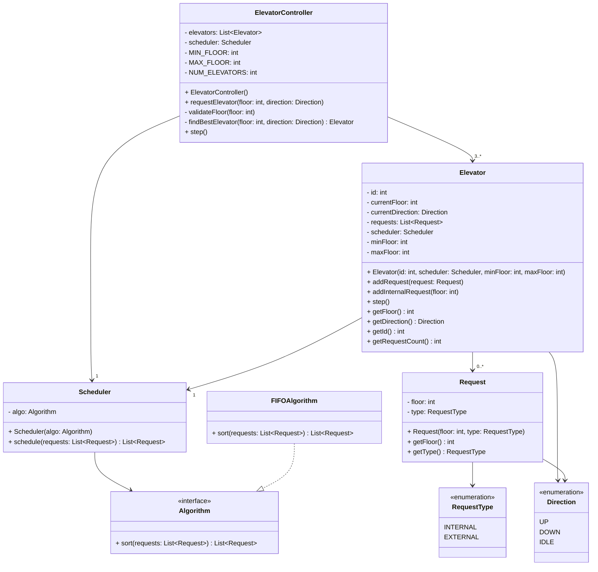

# Elevator System - Class Diagram

## Design Overview

**ElevatorController**: Manages the fleet of elevators and dispatches requests to the best available elevator based on distance, direction, and current state.

**Elevator**: Represents a single elevator that processes requests, moves between floors, and updates its direction based on scheduled requests.

**Scheduler**: Uses an algorithm to sort and optimize the order of floor requests for efficient elevator movement.

**Algorithm Interface**: Allows for different scheduling strategies (currently FIFO, but extensible to SCAN, SSTF, etc.).

**Request**: Represents a request to visit a floor, categorized as either INTERNAL (inside elevator) or EXTERNAL (outside elevator).

**Enums**: 
- **Direction**: UP, DOWN, IDLE states
- **RequestType**: INTERNAL or EXTERNAL request types
