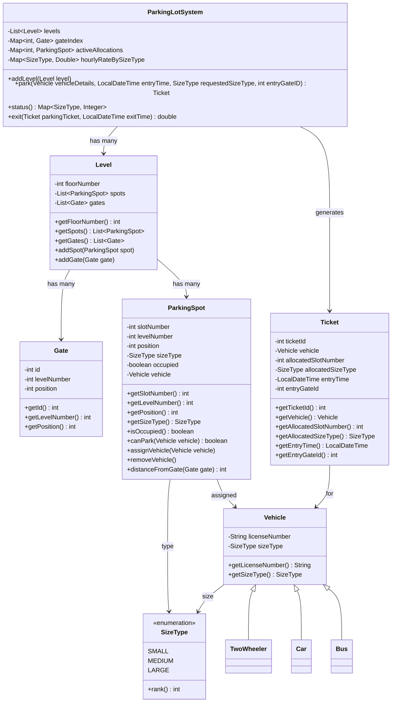

# Parking Lot Class Diagram

```mermaid
classDiagram
    class ParkingLotSystem {
        -List~Level~ levels
        -Map~int, Gate~ gateIndex
        -Map~int, ParkingSpot~ activeAllocations
        -Map~SizeType, Double~ hourlyRateBySizeType
        +addLevel(Level level)
        +park(Vehicle vehicleDetails, LocalDateTime entryTime, SizeType requestedSizeType, int entryGateID) Ticket
        +status() Map~SizeType, Integer~
        +exit(Ticket parkingTicket, LocalDateTime exitTime) double
    }

    class Level {
        -int floorNumber
        -List~ParkingSpot~ spots
        -List~Gate~ gates
        +getFloorNumber() int
        +getSpots() List~ParkingSpot~
        +getGates() List~Gate~
        +addSpot(ParkingSpot spot)
        +addGate(Gate gate)
    }

    class Gate {
        -int id
        -int levelNumber
        -int position
        +getId() int
        +getLevelNumber() int
        +getPosition() int
    }

    class ParkingSpot {
        -int slotNumber
        -int levelNumber
        -int position
        -SizeType sizeType
        -boolean occupied
        -Vehicle vehicle
        +getSlotNumber() int
        +getLevelNumber() int
        +getPosition() int
        +getSizeType() SizeType
        +isOccupied() boolean
        +canPark(Vehicle vehicle) boolean
        +assignVehicle(Vehicle vehicle)
        +removeVehicle()
        +distanceFromGate(Gate gate) int
    }

    class Ticket {
        -int ticketId
        -Vehicle vehicle
        -int allocatedSlotNumber
        -SizeType allocatedSizeType
        -LocalDateTime entryTime
        -int entryGateId
        +getTicketId() int
        +getVehicle() Vehicle
        +getAllocatedSlotNumber() int
        +getAllocatedSizeType() SizeType
        +getEntryTime() LocalDateTime
        +getEntryGateId() int
    }

    class Vehicle {
        -String licenseNumber
        -SizeType sizeType
        +getLicenseNumber() String
        +getSizeType() SizeType
    }

    class TwoWheeler
    class Car
    class Bus

    class SizeType {
        <<enumeration>>
        SMALL
        MEDIUM
        LARGE
        +rank() int
    }

    ParkingLotSystem --> Level : has many
    ParkingLotSystem --> Ticket : generates
    Level --> ParkingSpot : has many
    Level --> Gate : has many
    ParkingSpot --> SizeType : type
    ParkingSpot --> Vehicle : assigned
    Ticket --> Vehicle : for
    Vehicle <|-- TwoWheeler
    Vehicle <|-- Car
    Vehicle <|-- Bus
    Vehicle --> SizeType : size
```
