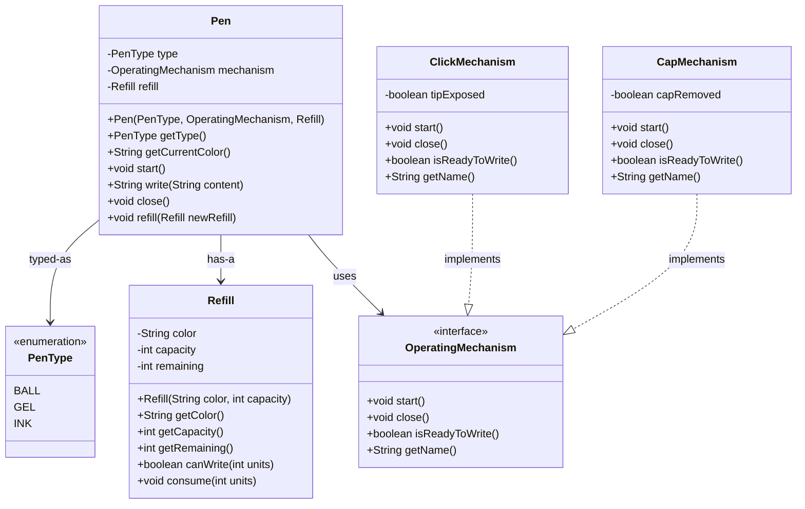

# Pen Design Class Diagram

```mermaid
classDiagram
    class Pen {
        -PenType type
        -OperatingMechanism mechanism
        -Refill refill
        +Pen(PenType, OperatingMechanism, Refill)
        +PenType getType()
        +String getCurrentColor()
        +void start()
        +String write(String content)
        +void close()
        +void refill(Refill newRefill)
    }

    class Refill {
        -String color
        -int capacity
        -int remaining
        +Refill(String color, int capacity)
        +String getColor()
        +int getCapacity()
        +int getRemaining()
        +boolean canWrite(int units)
        +void consume(int units)
    }

    class OperatingMechanism {
        <<interface>>
        +void start()
        +void close()
        +boolean isReadyToWrite()
        +String getName()
    }

    class ClickMechanism {
        -boolean tipExposed
        +void start()
        +void close()
        +boolean isReadyToWrite()
        +String getName()
    }

    class CapMechanism {
        -boolean capRemoved
        +void start()
        +void close()
        +boolean isReadyToWrite()
        +String getName()
    }

    class PenType {
        <<enumeration>>
        BALL
        GEL
        INK
    }

    Pen --> Refill : has-a
    Pen --> OperatingMechanism : uses
    Pen --> PenType : typed-as
    ClickMechanism ..|> OperatingMechanism : implements
    CapMechanism ..|> OperatingMechanism : implements
```
