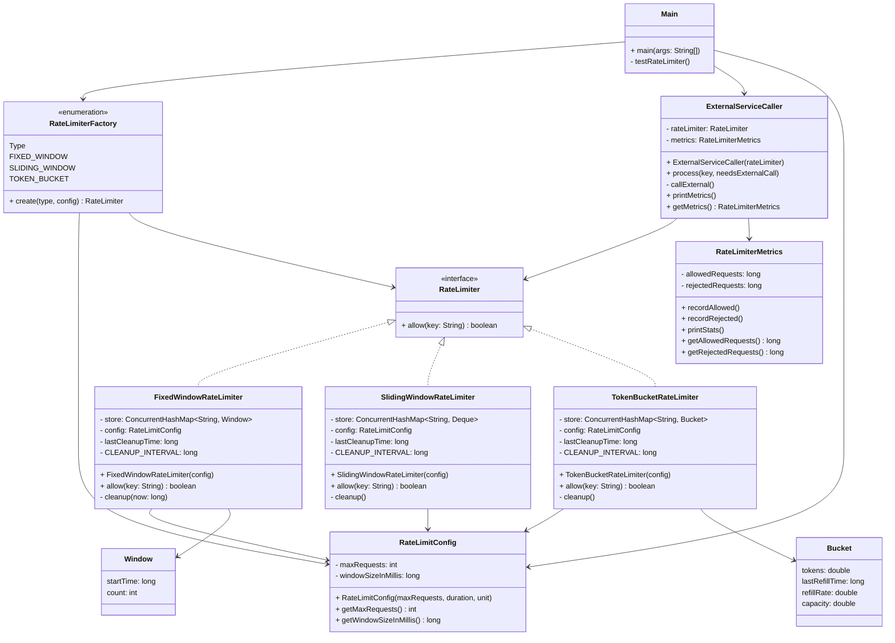

# Rate Limiter System - Class Diagram

## Component Overview

### Core Interface
**RateLimiter**: Interface defining the contract for rate limiting with `allow(key)` method.

### Algorithm Implementations

**FixedWindowRateLimiter**
- Divides time into fixed intervals (windows)
- Resets counter at window boundaries
- **Pros**: Simple, fast O(1) operations
- **Cons**: Thundering herd problem at window edges

**SlidingWindowRateLimiter**
- Maintains queue of request timestamps
- Removes stale entries outside the window
- **Pros**: Smooth rate limiting, fair distribution
- **Cons**: Higher memory overhead, O(n) cleanup

**TokenBucketRateLimiter**
- Tokens accumulate at fixed refill rate
- Allows burst traffic while maintaining average rate
- **Pros**: Burst-friendly, smooth, realistic
- **Cons**: Requires floating-point calculations

### Configuration & Factory
**RateLimitConfig**: Encapsulates max requests and time window settings.

**RateLimiterFactory**: Factory pattern with enum for creating different rate limiter instances without changing client code.

### Monitoring
**RateLimiterMetrics**: Tracks allowed/rejected requests and calculates rejection rate percentage.

**ExternalServiceCaller**: Client using the rate limiter with built-in metrics tracking.

## Key Features

✅ **Multiple Algorithms**: Choose based on use case (fixed/sliding/token-bucket)
✅ **Thread-Safe**: ConcurrentHashMap with synchronization
✅ **Memory Efficient**: Periodic cleanup prevents memory leaks
✅ **Observable**: Metrics for monitoring allowed/rejected requests
✅ **Configurable**: Time units and max requests easily configurable
✅ **Extensible**: Easy to add new algorithms via RateLimiter interface
