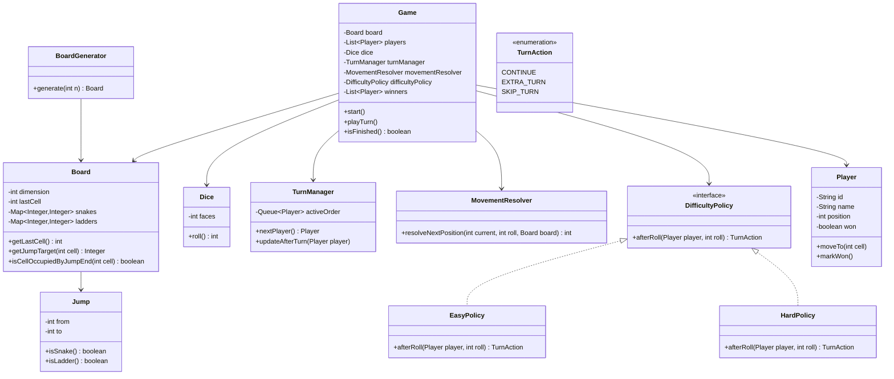

# Snake and Ladder Class Diagram

```mermaid
classDiagram
    class Game {
        -Board board
        -List~Player~ players
        -Dice dice
        -TurnManager turnManager
        -MovementResolver movementResolver
        -DifficultyPolicy difficultyPolicy
        -List~Player~ winners
        +start()
        +playTurn()
        +isFinished() boolean
    }

    class Board {
        -int dimension
        -int lastCell
        -Map~Integer,Integer~ snakes
        -Map~Integer,Integer~ ladders
        +getLastCell() int
        +getJumpTarget(int cell) Integer
        +isCellOccupiedByJumpEnd(int cell) boolean
    }

    class Player {
        -String id
        -String name
        -int position
        -boolean won
        +moveTo(int cell)
        +markWon()
    }

    class Dice {
        -int faces
        +roll() int
    }

    class TurnManager {
        -Queue~Player~ activeOrder
        +nextPlayer() Player
        +updateAfterTurn(Player player)
    }

    class MovementResolver {
        +resolveNextPosition(int current, int roll, Board board) int
    }

    class BoardGenerator {
        +generate(int n) Board
    }

    class Jump {
        -int from
        -int to
        +isSnake() boolean
        +isLadder() boolean
    }

    class DifficultyPolicy {
        <<interface>>
        +afterRoll(Player player, int roll) TurnAction
    }

    class EasyPolicy {
        +afterRoll(Player player, int roll) TurnAction
    }

    class HardPolicy {
        +afterRoll(Player player, int roll) TurnAction
    }

    class TurnAction {
        <<enumeration>>
        CONTINUE
        EXTRA_TURN
        SKIP_TURN
    }

    Game --> Board
    Game --> Dice
    Game --> TurnManager
    Game --> MovementResolver
    Game --> DifficultyPolicy
    Game --> Player
    Board --> Jump
    BoardGenerator --> Board
    DifficultyPolicy <|.. EasyPolicy
    DifficultyPolicy <|.. HardPolicy
```
